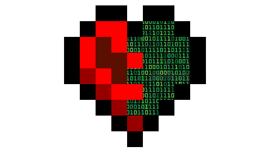

    
    

        Vital
         
        A modular Minecraft plugin framework for Spigot, Paper, and BungeeCord.
         
        It simplifies development by handling setup, commands, localization, and more. It offers easy-to-use APIs and cross-platform support, making plugins smaller and easier to maintain.
    

    <!--
    
    -->
    

---

## Highlights

- **No `plugin.yml` needed** – Vital auto-handles plugin setup.
- **Advanced commands system** – Easy command creation with auto tab-completion right out of the box.
- **Dynamic and easy scoreboards api** – Simple creation of updatable scoreboards.
- **Localization** – Built-in support for multilingual plugins.
- **Interactable items** – Create interactable items with ease.
- **Modular** – Only use the necessary features for a lightweight plugin.

## Comparisons

Not convinced yet?  
Check out some comparisons between Vital and Spigot [here](COMPARISONS.md)